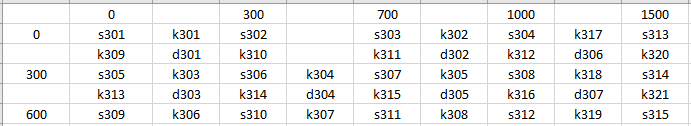

# Introduction

This project made for improving myself at creating algorithms and repeating the knowledge of, engineering of reinforcement concrete structures. This project made by me at last semester of the Civil Engineer program at Manisa Celal Bayar University.

## Usage

This algorithm uses a Excel file(Kat.xlsx) for the giving the inputs about floor plan structural elements.

<li> Elements with letter s represents Collumns
<li> Elements with letter k represents Beams
<li> Elements with letter d represents Slabs
 
 
The numbers like 0-300-600 etc. represents the Coordinates of X axis and Y axis of collumns and due that beams and slabs coordinates are known aswell. These coordinates should be given as intersections of collumns. Other inputs about engineering is given right in the "BetonarmeProgram.m" Matlab file.
 
 

You can view with the following [link](https://drive.google.com/file/d/1kcVTutdxWvGGXAKoUscMKFv31t5GU3U_/view "a title") to understand how the algorithm works and get details about the project in Turkish.